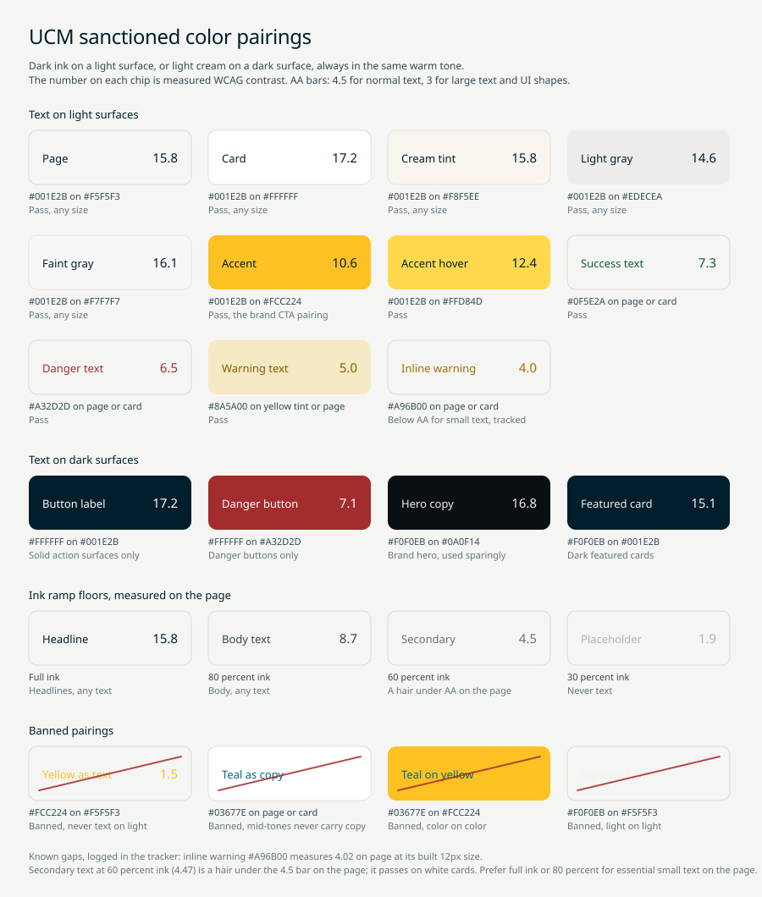

# Color pairings

One principle: text is always a dark ink-family color on a light surface, or
a light cream-family color on a dark surface, staying inside the same
warm-neutral tone. Mid-tones never sit under text and never act as text.
The ratios below are measured WCAG contrast; the bars are 4.5 to 1 for
normal text and 3 to 1 for large text and UI shapes (AA). Anything not in
these tables is not a sanctioned pairing.

The tokens themselves, the ramps, and the decorative sub-palette live in the
color page (guidelines/color.md).

## Text on light surfaces

| Text | Background | Ratio | Verdict |
|---|---|---|---|
| Ink #001E2B | Page #F5F5F3 | 15.8 | Pass, any size |
| Ink #001E2B | Card #FFFFFF | 17.2 | Pass, any size |
| Ink #001E2B | Cream tint #F8F5EE | 15.8 | Pass, any size |
| Ink #001E2B | Light gray #EDECEA | 14.6 | Pass, any size |
| Ink #001E2B | Faint gray #F7F7F7 | 16.1 | Pass, any size |
| Ink #001E2B | Accent #FCC224 | 10.6 | Pass, the brand CTA pairing |
| Ink #001E2B | Accent hover #FFD84D | 12.4 | Pass |
| Success #0F5E2A | Page or card | 7.3 to 7.9 | Pass |
| Danger #A32D2D | Page or card | 6.5 to 7.1 | Pass |
| Warning #8A5A00 | Yellow tint or page | 5.0 to 5.4 | Pass |
| Inline warning #A96B00 | Page or card | 4.0 to 4.4 | Below AA for small text, see the note |

## Text on dark surfaces

| Text | Background | Ratio | Verdict |
|---|---|---|---|
| White #FFFFFF | Ink #001E2B | 17.2 | Pass, solid action surfaces (buttons) only |
| White #FFFFFF | Danger #A32D2D | 7.1 | Pass, danger buttons only |
| Ink on dark #F0F0EB | Hero dark #0A0F14 | 16.8 | Pass |
| Ink on dark #F0F0EB | Ink #001E2B | 15.1 | Pass, dark featured cards |

White appears as text only inside solid action surfaces, the navy and
danger buttons. Content on dark surfaces uses ink-on-dark #F0F0EB, never
pure white.

## Ink ramp floors

The opacity ramp is a readability ladder, not a free choice:

| Step | Ratio on page | Allowed for |
|---|---|---|
| Full ink to 78 percent | 8.2 and up | Any text |
| 65 percent | 5.3 | Body and smaller; the minimum for essential text |
| 55 percent | 3.8 | Large text and advisory fine print only, never essential small text |
| 45 and 35 percent | 2.9 and 2.2 | Icon strokes, placeholders, disabled states; never essential text |

## Banned pairings

- Yellow as text on any light surface: 1.5 to 1, unreadable. Yellow is a
  surface and an accent, never a text color on light. On ink it measures
  10.6 and may serve small brand accents, never body text.
- Any mid-tone as text or under text: the decorative sub-palette never
  carries copy.
- Color on color: semantic colors sit on light neutral surfaces or carry
  white; never success on a danger tint, teal on yellow, or any similar
  pairing.
- Light on light or mid on mid: every text pairing is dark with light, in
  that order or reversed, never two tones from the middle of the range.

## Known gaps, logged in the tracker

- Inline warning #A96B00 measures 4.02 on page, below the 4.5 bar at its
  built 12px size. Until the token is revisited, keep inline warnings short
  and prefer #8A5A00 (5.4) where strict AA applies.
- Field labels at 55 percent ink (3.8) pass only the large-text bar. Prefer
  65 percent for any label that carries meaning.
