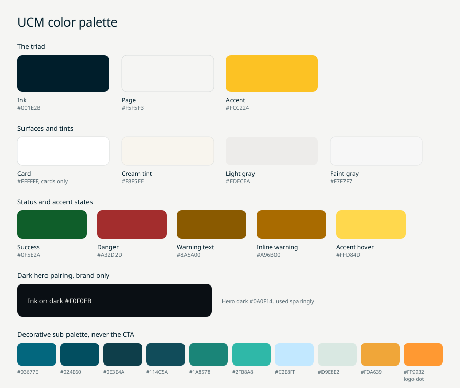

# Color

The whole system is one triad: cream page, navy ink, yellow accent. Every
other value is a ramp, a status color, or a small decorative sub-palette.
New hues are never introduced.

## The tokens

| Token | Hex | Role |
|---|---|---|
| Ink | #001E2B | Text and borders, used everywhere instead of black |
| Page | #F5F5F3 | Page background |
| Accent | #FCC224 | Yellow accent, the brand primary CTA |
| Accent hover | #FFD84D | Accent hover state |
| Success | #0F5E2A | Success text and tint base |
| Danger | #A32D2D | Danger text and button background |
| Card | #FFFFFF | Card surface, the one allowed pure white |
| Cream tint | #F8F5EE | Pill chips, soft callouts |
| Light gray | #EDECEA | Nav pill background, secondary surface |
| Faint gray | #F7F7F7 | Inputs, inactive pill states (brand) |
| Ink on dark | #F0F0EB | Text on dark featured cards |
| Hero dark | #0A0F14 | Cinematic dark hero, brand only |

## The rules that keep it honest

- Never pure black, never pure white as ink or surface. Ink is #001E2B, the
  page is #F5F5F3. White #FFFFFF exists only as a card surface.
- Yellow stays scarce: never more than about 10 percent of any surface.
- Borders are navy with alpha, never gray and never black.
- Sanctioned pairings: cream #F5F5F3 with ink #001E2B, or hero dark #0A0F14
  with ink-on-dark #F0F0EB, used sparingly and in brand mode only.
- Gradient text is banned. The GlowButton radial is the one gradient in the
  system, brand only.

## Ink opacity ramp

Text steps down in opacity, never into gray hues:

| Value | Use |
|---|---|
| #001E2B | Headlines, focused input text |
| #001E2B at 85 percent | Body emphasis |
| #001E2B at 78 percent | Body, list items, paragraphs |
| #001E2B at 65 percent | Secondary body |
| #001E2B at 55 percent | Tertiary labels, fine print |
| #001E2B at 45 percent | Subdued icon stroke |
| #001E2B at 35 percent | Placeholder text |

Borders and dividers:

| Value | Use |
|---|---|
| #001E2B at 8 percent | Faint hairlines, in-card dividers |
| #001E2B at 10 percent | Default card border |
| #001E2B at 12 percent | Default input border |
| #001E2B at 15 percent | Outlined buttons |
| #001E2B at 25 percent | Hover state on cards and inputs |

## Accent and status ramps

| Value | Use |
|---|---|
| #FCC224 | Accent base |
| #FCC224 at 22 percent | Soft tinted background |
| #FCC224 at 60 percent | Strong border on an empty or attention field |
| #FCC224 at 25 percent | Ring partner to that border |
| #8A5A00 | Text on a yellow-tinted background |
| #A96B00 | Inline warning text |

Status: success #0F5E2A text with a 22 percent tint; danger #A32D2D text and
button background with a 10 percent hover tint; warning always uses the
accent family above, never a new orange or red.

## Decorative sub-palette

Decorative only, never the CTA, never a primary: teals #03677E, #024E60,
#0E3E4A, #114C5A, #1A8578, #2FB8A8; light blue #C2E8FF; light cyan #D9E8E2;
brand orange #F0A639; and the logo accent dot #FF9932, which belongs to the
"ucm." wordmark and nothing else.

## Coming from the old palette

The pre-2026 brand guide listed 22 colors. The mapping from every old value
to its replacement lives in the Brand Hub page, section "Migrating from the
old palette" (guidelines/brand-hub.md).
