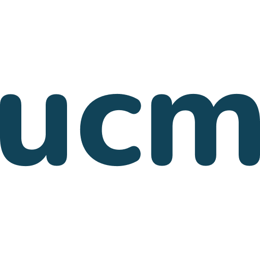
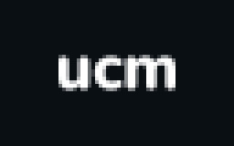

# The logo

The logo is the wordmark "ucm." in lowercase, closed by the accent dot. It
is a delivered asset: the files are the logo, and nothing else is.

This page is the canonical source. A generated PDF companion with the
images, for attaching to Confluence, lives at assets/logo-usage.pdf;
regenerate it after editing this page, never edit it directly.

## The wordmark rule

- The logo is always "ucm." in lowercase, closed by the accent dot in
  #FF9932. Never "UCM", never "Ucm", never without the dot.
- The wordmark is set in Nunito Extra-Bold 800. Nunito is used for nothing
  else, anywhere.
- Never retype or rebuild the logo. The face and tracking are documented,
  but the wordmark is an asset, not a text style; use the delivered files.
- The lowercase form belongs to the logo alone. In running text the name is
  written UCM. Domain-style names such as ucm.jobs and ucm.agency stay
  lowercase, because they are domains, not the wordmark.

## The accent dot

The dot is #FF9932, the value the specs list as the logo accent dot. It is
not the triad yellow #FCC224. The dot color belongs to the wordmark and
nothing else: it never colors buttons, icons, text, or any other UI
element. The full decorative sub-palette lives in the color page
(guidelines/color.md).

## The files

Only use the files from the official branding elements folder on Google
Drive (UCM account required):

https://drive.google.com/drive/folders/1I6p89HNb2kteBE6LIKWr4fAlxixvjdFb

No logo files live in the repo yet, by decision of 2026-07-06: they enter
brand/assets/logos/ only when the brand owner gives an explicit go. Until
then the Drive folder is the single source, and brand/assets/logos/ holds
a README pointing at it.

## Which logo goes where

| Surface | Logo form |
|---|---|
| Interface chrome: the ucm.jobs header and footer, the docs site header | The wordmark as type: "ucm." in Nunito Extra-Bold 800, letters in ink #001E2B, the dot in #FF9932. The spec type style is 22px with tracking -0.04em. |
| Browser favicon, light scheme | The dark wordmark icon, 32 and 48px (in production: ucm-logo_pine.png) |
| Browser favicon, dark scheme | The light wordmark icon, 32px (in production: ucm-logo_white.png) |
| Touch and app icons | The dark wordmark icon at 180, 192, and 512px |
| Decks, documents, social media, print, partner and press use | Delivered files from the branding elements folder, never typed |

Interface chrome is the one place the wordmark may be typed instead of
placed, because that code is under design-system control and uses the
documented face and tokens. Every other surface uses the delivered files.

## The set, one by one

The images below are production records: the assets the live site serves
today, kept in assets/logos/production/. They show the current state
including its known divergences (next section); the official kit files
stay on Drive until the brand owner's go.

### The typed wordmark, interface chrome only

- Use for: the site header and footer and the docs header, as code.
- Letters in ink #001E2B, the dot in #FF9932, on a white pill; white here
  is an action-surface use, matching the button exception.
- Never use typed form in a document, deck, image, or any surface outside
  the design-system-controlled chrome. There it is always a placed file.

### The dark wordmark icon

- Use for: the light-scheme browser favicon (32 and 48px) and the touch
  and app icons (180, 192, 512px).
- The icon sits on light or system-provided surfaces; never place it on
  the dark hero, that is what the light icon is for.
- Production state shown: dotless and in the retired Pine color. The rule
  says closed by the dot and ink #001E2B; see the divergences below.

### The light wordmark icon

- Use for: the dark-scheme browser favicon (32px) and dark surfaces where
  the dark icon would vanish.
- The source file is white on transparent (assets/logos/production/
  ucm-logo_white-32.png); the image above places it on a hero-dark #0A0F14
  swatch so it is visible here. Content text on dark surfaces stays
  ink-on-dark #F0F0EB; the pure white in this icon is a logo-only
  exception, pending the owner's ruling in the tracker.
- Production state shown: dotless, same divergence as the dark icon.

### The delivered kit files

No images yet: the kit lives in the branding elements folder on Drive and
its files enter the repo only on the brand owner's go. Use the kit for
everything that is not interface chrome or a favicon: decks, documents,
social media, print, partner and press use. When the kit's file list is
known, each variant gets its own entry here.

## Known divergences, logged in the tracker

The live ucm.jobs site diverges from the rules above in ways only the brand
owner can resolve (update production, or amend the rule):

- The live dot renders in the triad yellow #FCC224, not #FF9932, and the
  live header type is 18px with letter-spacing 0, not the spec style.
- The production favicon and app icons draw the wordmark without the
  closing dot, and in the retired Pine color rather than ink #001E2B.

Until those decisions land, this page states the rules and the tracker
holds the audit.

## Motion

Logo motion follows the global motion rules (guidelines/motion.md):
transform, opacity, and clip-path only, ease-out, off under reduced motion.
The logo reveal and letter animations use the standard ease
cubic-bezier(0.16, 1, 0.3, 1). Marquee logo parades (client and partner
logos) are a brand-mode pattern and never appear in product mode.

## Not yet migrated from the old Brand Guide

Clear space, minimum size, and placement contrast rules live in the old
Brand Guide and have not been migrated into this book yet. Until they are,
follow the Brand Guide and the proportions of the delivered files. The same
applies to variants (dark surface, single color): whatever the branding
elements folder delivers is sanctioned; nothing else is. Both gaps are
logged as open questions in the tracker.
